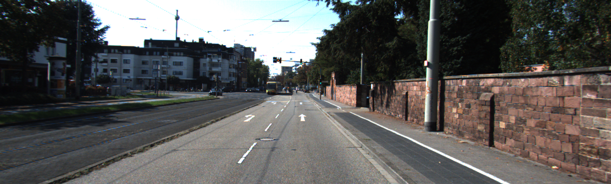
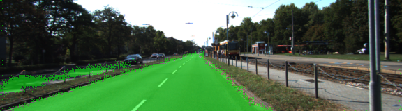
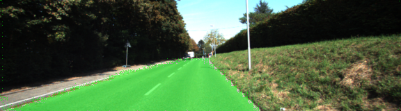
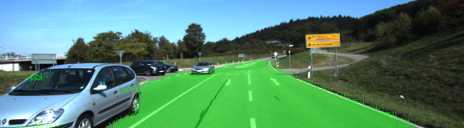
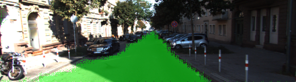

# Semantic Segmentation

This project is part of my Udacity Self-Driving-Car Nano Degree project, was originally forked from [Udacity](https://github.com/udacity/CarND-Semantic-Segmentation) then modified by olala7846@gmail.com

for the origin project setup, please reference [Udacity's Repo](https://github.com/udacity/CarND-Semantic-Segmentation)

## Introduction
Sementic Segmentation with Fully Convolutional Networks using Python Tensorflow

##### Frameworks and Packages
Make sure you have the following is installed:
 - [Python 3](https://www.python.org/)
 - [TensorFlow](https://www.tensorflow.org/)
 - [NumPy](http://www.numpy.org/)
 - [SciPy](https://www.scipy.org/)
##### Dataset
[Kitti Road dataset](http://www.cvlibs.net/datasets/kitti/eval_road.php)

## Report
I implemented the [FCN-8 architecture](https://people.eecs.berkeley.edu/~jonlong/long_shelhamer_fcn.pdf) and train on AWS spot instances

The training data looks the following image

And the label data looks like this

The purple pixels are labeld as road.

After training 60 epochs, the results looks like the followin images

